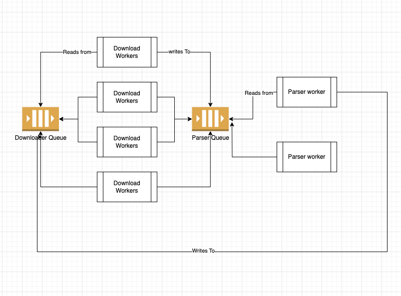

# Design


# How to run the code

<ol>
    <li>Clone the repo locally</li>
    <li>cd url-checker</li>
    <li>go mod tidy</li>
    <li>go run main.go</li>
</ol>

# How to use
```
urlCrawler := crawler.New(crawler.Options{})
urlCrawler.Start("https://monzo.com")
for !urlCrawler.IsDone() {
    time.Sleep(1 * time.Second)
}
urlCrawler.Stop()

```

